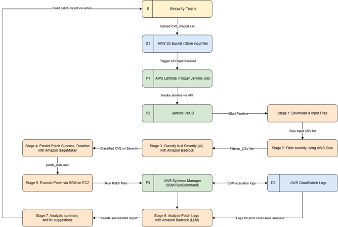
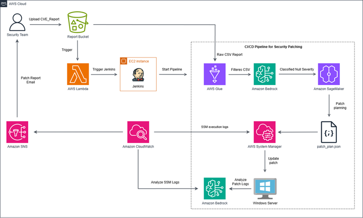

# CI/CD PIPELINE FOR AUTOMATING WINDOWS SECURITY PATCHING FROM VULNERABILITY REPORT

## Solutions Introduction

In modern corporate environments, particularly within the financial and banking sectors, managing operating system vulnerabilities remains a significant challenge. The process is often manual, fragmented, and time-consuming, creating barriers to effective cybersecurity operations. Security teams are tasked with regularly scanning systems and compiling vulnerability reports using specialized tools. These reports typically include lists of Common Vulnerabilities and Exposures (CVEs), their severity levels, affected OS packages, and recommended patches. However, the output is usually in CSV or Excel format and requires extensive manual effort to filter, prioritize, and coordinate with system administrators for patch deployment.

This workflow introduces several critical limitations and risks:
- **Delayed remediation** of high-severity vulnerabilities
- **Human errors** in prioritizing CVEs and executing patches
- **Inconsistent documentation**, making audit and compliance efforts difficult
- Manual **Lack of scalability** when managing large Windows Server environments

Our solution fulfills this need through a fully automated **CI/CD pipeline for Windows security patching**, enriched with AI-driven decision-making based on vulnerability report analysis. The pipeline is designed to:
- **Ingest vulnerability reports** in CSV/Excel format, either via upload or through an API.
- **Filter and prioritize CVEs** based on severity (Critical/High) and relevance to Windows systems.
- **Automatically trigger patching operations** using PowerShell scripts, executed through AWS Systems Manager.
- **Log, track, and report the results** of each patch operation, including success/failure metrics.

## Impact of Solution 

What makes our project unique is the combination of automation, artificial intelligence, and infrastructure design with cloud computing:
- **AI-enhanced patching decisions:** Using Amazon SageMaker to estimate patch duration and probability of success helps teams prioritize more intelligently.
- **Failure intelligence**: Integration with Amazon Bedrock allows LLM to analyze failed patch logs and recommend possible solutions—dramatically reducing time to fix.
- **End-to-end traceability**: With AWS Systems Manager, CloudWatch, and S3 logs, every patch can be tracked, verified, and audited.
- **Event-based and fully automated**: Pipelines automatically trigger when a file is uploaded or an API is crawled—no manual intervention required.
- **Adaptable to real-world business constraints**: The system is modular and adaptable to the realities of the enterprise environment, supporting hybrid cloud and strict access controls.

## Deep Dive into Solution 

Our solution is an end-to-end CI/CD pipeline for automating Windows security patching using AWS cloud services, Jenkins, and AI/ML components. The **Level 2 Data Flow Diagram** (see image above) breaks down the pipeline into seven clearly defined stages, showing how data flows between services and how automation is orchestrated across the stack.

### E. Security team
- The process starts with the Security Team uploading a vulnerability report in .csv format. This file is generated by standard vulnerability scanning tools and contains information such as CVE ID, severity level, affected OS, and patch notes.

### D1. AWS S3 Bucket – Data Ingestion Layer
- The uploaded file is stored in a designated S3 bucket. This storage bucket acts as a centralized input source.
- When a new file is added, an s3:ObjectCreated event is emitted.

### P1. AWS Lambda – Trigger Mechanism
- The S3 event triggers an AWS Lambda function that initiates the CI/CD pipeline by calling the Jenkins job via its API.
- This event-driven approach makes the workflow fully autonomous and eliminates the need for manual intervention.

### P2. Jenkins CI/CD – Pipeline Orchestrator
- Jenkins acts as the core orchestrator, coordinating all the stages of the pipeline.
- It pulls in the input file and triggers subsequent processes.

### Stage 1: Download & Input Preparation
- Jenkins downloads the raw .csv file from S3 and prepares it for processing.
- This stage includes validation of the CSV format and checks for missing fields or malformed entries.

### Stage 2: Filter Severity using AWS Glue
- AWS Glue is used to parse and clean the raw CSV data.
- It filters for Critical and High severity CVEs and exports a clean, filtered file for classification.

### Stage 3: Classify Unknown Severity using Amazon Bedrock (Optional AI Layer)
- If there are entries with null or unknown severity, they are passed to an LLM model via Amazon Bedrock.
- The model classifies the severity level based on context and CVE description, enhancing the quality of data even when inputs are incomplete.

### Stage 4: Predict Patch Duration and Success Probability using Amazon SageMaker
- Amazon SageMaker is used to run an ML model trained on historical patching data.
- For each CVE, the model predicts:
    - Estimated patching duration
    - Success probability
- The outcome is saved into a patch_plan.json file, which drives the next step.

### Stage 5: Execute Patch via AWS Systems Manager (SSM)
- Using the patch plan, Jenkins invokes AWS SSM Run Command  (P3) to trigger PowerShell patching scripts on Windows EC2 instances.
- This is done securely without the need for SSH or RDP access.
- The patch execution is fully logged to CloudWatch Logs (D2) for audit and observability.

### Stage 6: Analyze Patch Logs with Amazon Bedrock (LLM)
- CloudWatch logs are sent to Amazon Bedrock to analyze patch failures.
- The LLM interprets errors, provides probable causes, and recommends corrective actions in natural language.
- This reduces the burden of log analysis for engineers and speeds up troubleshooting.

### Stage 7: Analysis summary and fix suggestions
- After patch execution, the pipeline generates a success/failure report.
- The report is emailed to the security team with details like:
    - Patched systems
    - CVEs resolved
    - Errors encountered (if any)
    - Estimated vs. actual duration

## Architecture of Solution

Our solution is designed as a fully automated and intelligent CI/CD pipeline that integrates multiple AWS services to address security patching issues for Windows Server environments. Instead of implementing individual AWS services, we integrate them into a seamless, event-driven architecture that ensures efficiency, scalability, and end-to-end transparency.

The process begins when the Security Team uploads the CVE report (in CSV or Excel format) to an Amazon S3 bucket. This triggers the s3:ObjectCreated event, which then invokes an AWS Lambda function. This function is responsible for triggering a Jenkins pipeline hosted on an Amazon EC2 instance, which acts as the central orchestrator of the patching process.

Once the pipeline is initialized, the report is passed to AWS Glue, which processes the raw CSV to extract critical and high-priority CVEs. If any items are missing severity values, they are automatically classified by Amazon Bedrock, which applies its large language model (LLM) capabilities to interpret the CVE descriptions.

The filtered and cleaned data is then passed to Amazon SageMaker, which predicts the expected success rate and estimated duration of patching tasks based on historical patching data. The results are written to a structured file (patch_plan.json) to guide and execute the patching job.

Next, AWS Systems Manager (SSM) takes this patch plan and executes patching commands remotely on Windows Server via SSM RunCommand. This avoids the need to open RDP/SSH access, greatly improving operational scalability and security.
The execution and monitoring logs generated during this phase are collected by Amazon CloudWatch, providing real-time visibility. These logs are also analyzed by Amazon Bedrock, which uses natural language processing to summarize the cause of failures and generate human-readable insights that can improve debugging efficiency and performance.

Finally, a summary report is compiled and sent to the Security Team via Amazon Simple Notification Service (SNS). This report includes details such as CVEs patched, success/failure rates, predicted vs. actual durations, and AI-generated recommendations for failure scenarios.
In summary, this solution combines the power of multiple AWS services in one unified, automated process:
- Amazon S3: Secure and scalable storage for CVE or Excel input files.
- AWS Lambda: Event-driven function to trigger Jenkins without maintaining a persistent backend.
- Amazon EC2 + Jenkins: Centralized CI/CD controller for pipeline orchestration.
- AWS Glue: Serverless ETL (Extract – Transform – Load) engine for parsing and filtering vulnerability reports.
- Amazon Bedrock: AI-based inference engine for CVE classification and patch log analysis.
- Amazon SageMaker: ML model for predicting patch outcomes, enabling proactive planning.
- AWS Systems Manager (SSM): Agent-based secure patch execution without manual access.
- Amazon CloudWatch: Unified logging and monitoring for all patching operations.
- Amazon SNS: Notification channel for report delivery and status updates