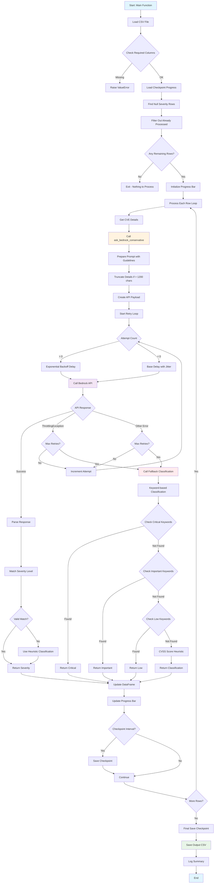

```mermaid
graph TD
    A[Start: Main Function] --> B[Load CSV File]
    B --> C{Check Required Columns}
    C -->|Missing| D[Raise ValueError]
    C -->|OK| E[Load Checkpoint Progress]
    
    E --> F[Find Null Severity Rows]
    F --> G[Filter Out Already Processed]
    G --> H{Any Remaining Rows?}
    H -->|No| I[Exit - Nothing to Process]
    H -->|Yes| J[Initialize Progress Bar]
    
    J --> K[Process Each Row Loop]
    K --> L[Get CVE Details]
    L --> M[Call ask_bedrock_conservative]
    
    M --> N[Prepare Prompt with Guidelines]
    N --> O[Truncate Details if > 1200 chars]
    O --> P[Create API Payload]
    P --> Q[Start Retry Loop]
    
    Q --> R{Attempt Count}
    R -->|> 0| S[Exponential Backoff Delay]
    R -->|= 0| T[Base Delay with Jitter]
    
    S --> U[Call Bedrock API]
    T --> U
    U --> V{API Response}
    
    V -->|Success| W[Parse Response]
    V -->|ThrottlingException| X{Max Retries?}
    V -->|Other Error| Y{Max Retries?}
    
    X -->|No| Z[Increment Attempt]
    X -->|Yes| AA[Call Fallback Classification]
    Y -->|No| Z
    Y -->|Yes| AA
    
    Z --> R
    
    W --> BB[Match Severity Level]
    BB --> CC{Valid Match?}
    CC -->|Yes| DD[Return Severity]
    CC -->|No| EE[Use Heuristic Classification]
    EE --> DD
    
    AA --> FF[Keyword-based Classification]
    FF --> GG{Check Critical Keywords}
    GG -->|Found| HH[Return Critical]
    GG -->|Not Found| II{Check Important Keywords}
    II -->|Found| JJ[Return Important]
    II -->|Not Found| KK{Check Low Keywords}
    KK -->|Found| LL[Return Low]
    KK -->|Not Found| MM[CVSS Score Heuristic]
    MM --> NN[Return Classification]
    
    DD --> OO[Update DataFrame]
    HH --> OO
    JJ --> OO
    LL --> OO
    NN --> OO
    
    OO --> PP[Update Progress Bar]
    PP --> QQ{Checkpoint Interval?}
    QQ -->|Yes| RR[Save Checkpoint]
    QQ -->|No| SS[Continue]
    RR --> SS
    
    SS --> TT{More Rows?}
    TT -->|Yes| K
    TT -->|No| UU[Final Save Checkpoint]
    UU --> VV[Save Output CSV]
    VV --> WW[Log Summary]
    WW --> XX[End]
    
    style A fill:#e1f5fe
    style M fill:#fff3e0
    style U fill:#f3e5f5
    style AA fill:#ffebee
    style VV fill:#e8f5e8
    style XX fill:#e1f5fe
```